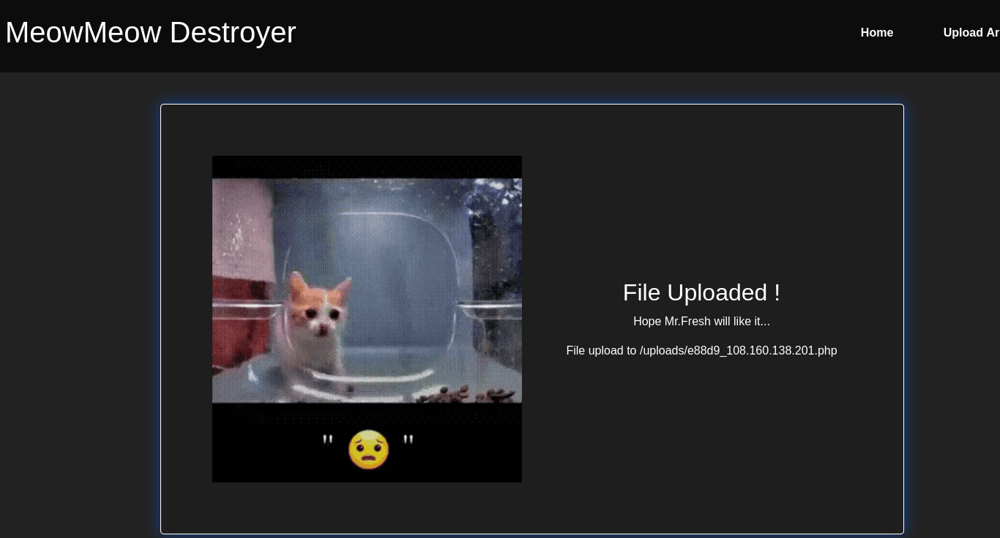
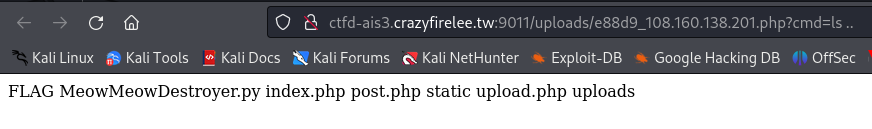
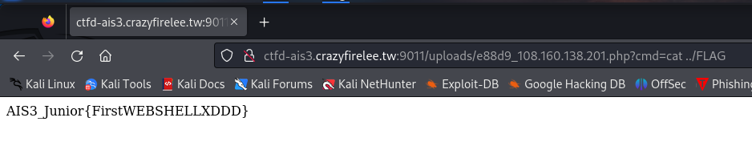
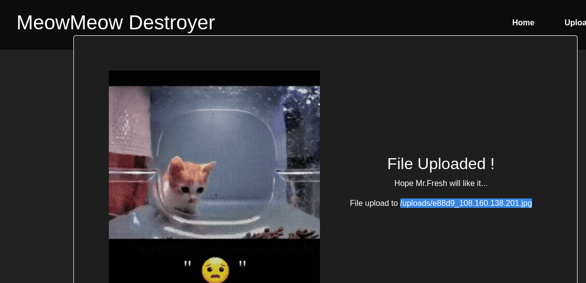
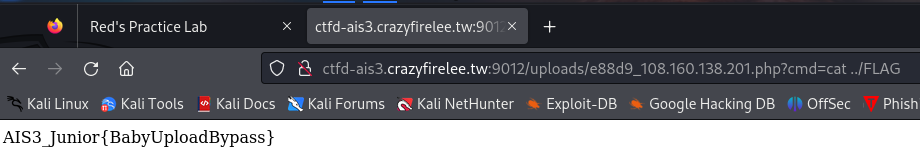
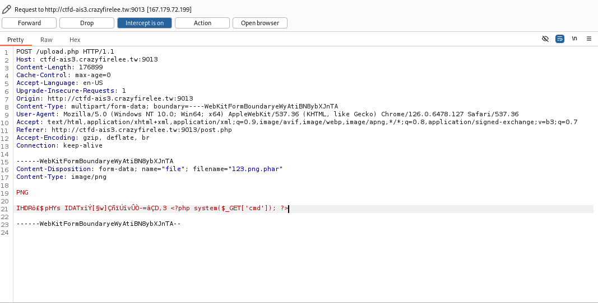
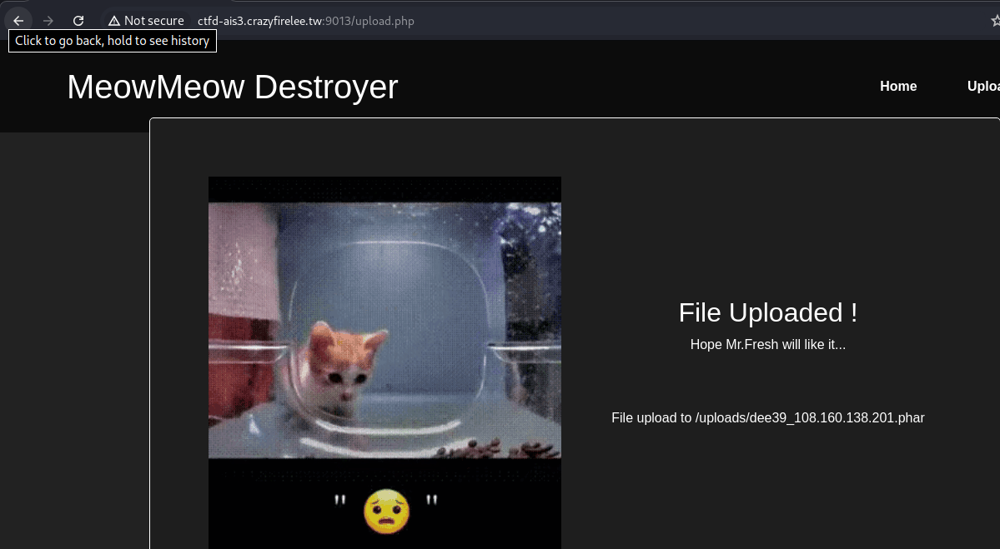
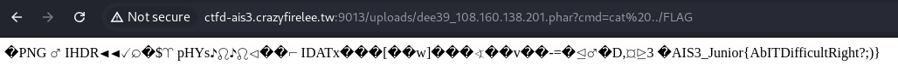

### web shell 程式碼

```<?php system($_GET['cmd']); ?>```

# FIL01
上傳webshell之後就會跳出webshell路徑

就透過webshell來入侵，在網址列打打指令，把檔案目錄叫出來

把flag cat出來

# FIL02
這題因為會看副檔名，所以把檔名變成JPG偷渡進去


接下來就跟前一題一樣啦



# FIL03
經過不停的在repeater輪迴後，發現它會過濾掉副檔名php，也會篩選內容，所以就留下magic-byte，再接上PHP木馬後改雙重檔名上傳


就成功上傳了，而且檔名也成功變成phar



接下來就與前兩題一樣，用cmd把flag拿出
