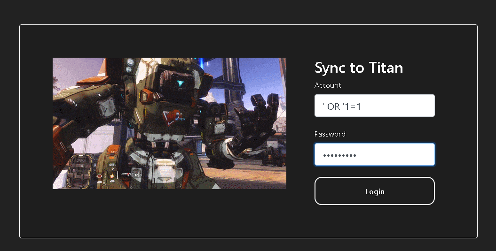
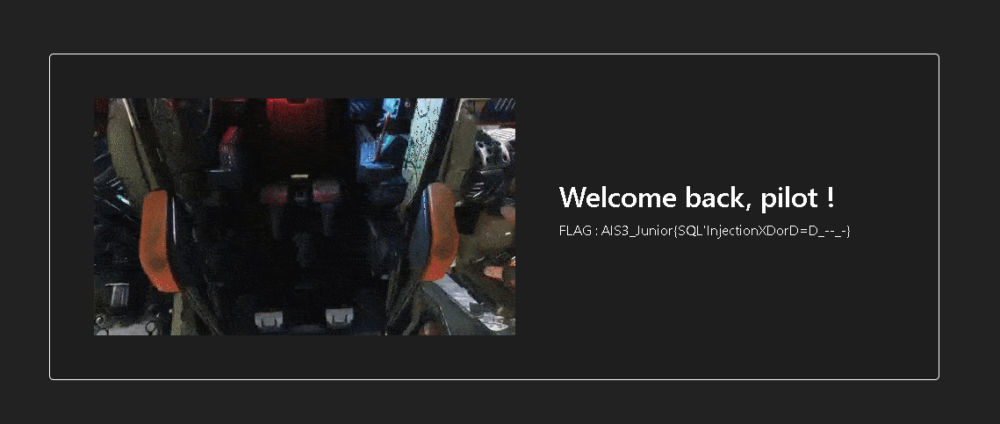
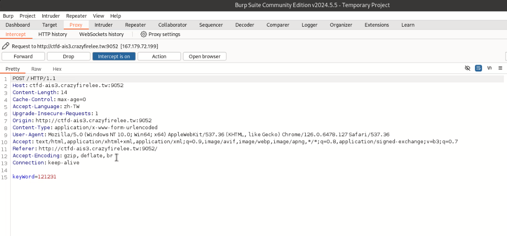
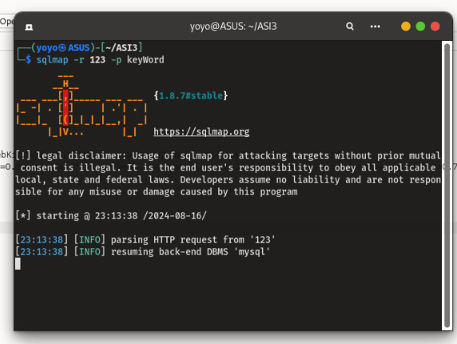
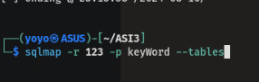
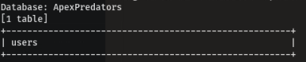
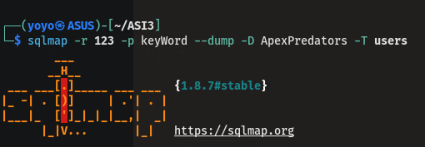
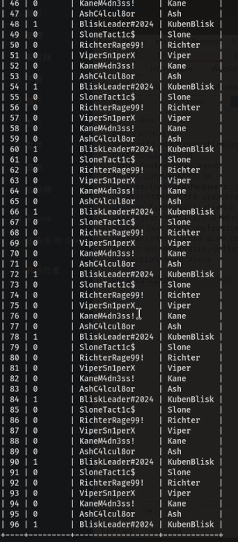
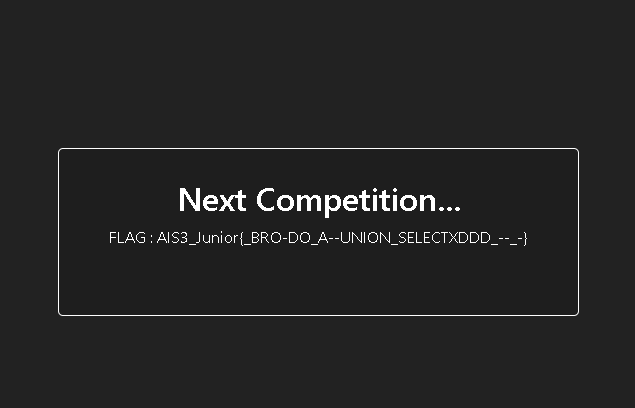

# SQL01
sql語法練習，~~跟xss的難度有得比~~

# SQL02
我用sqlmap對不起

先抓個封包

再來就是鼎鼎大名的sqlmap登場，把DBS目錄叫出來之後就有一個user的table十分可疑，~~身為柯南，真相只有一個~~，就是帳密在裡面

所以就把users這個table dump出來

果然拿到所有人的帳密了，接下就拿admin的帳密去登入就拿到flag了

