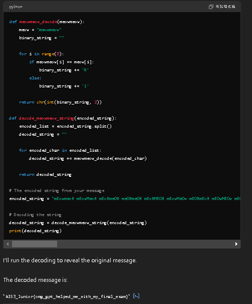

# 感受GPTㄉ魔力吧
他給我們被加密的字串，那我們當然就得解密啦，但是~~身為新手~~不會python跟反向怎麼辦呢? 那就給GPT吧



### 太棒了，~~以後CTF的python都交給你了 GPT~~

# AI 食譜大師
看來flag肯定是一道蔡

### 話說flag真的好好吃

# AI 履歷健檢

因為他會阻擋flag輸出，因此要稍微轉換一下flag

我以後履歷應該都寫得很好


# AI Markdown 文章翻譯
用SRF的方法就可以成功了


# 數學幫手?

他說他可以執行python，那就讓他去打開flag吧

# 貓貓線上商品專櫃

太酷了SQL也來了，就用sql語法吧

# FGSM
```
import tensorflow as tf
import numpy as np
from tensorflow.keras.applications import MobileNetV2
from tensorflow.keras.applications.mobilenet_v2 import preprocess_input, decode_predictions
from tensorflow.keras.preprocessing import image
import matplotlib.pyplot as plt
import os

# 載入預訓練的 MobileNetV2 模型
model = MobileNetV2(weights='imagenet')

# 載入並預處理狗的圖片
img_path = 'dog.jpg'  # 請替換成你的狗圖片路徑
img = image.load_img(img_path, target_size=(224, 224))
x = image.img_to_array(img)
x = np.expand_dims(x, axis=0)
x_orig = x.copy()  # 保存一份原始圖片數據
x = preprocess_input(x)

# 獲取原始預測
original_pred = model.predict(x)
print("Original prediction:", decode_predictions(original_pred, top=1)[0])

# 設定目標類別（貓）
target_class = 281  # ImageNet 中貓的類別索引

# 定義迭代 FGSM 攻擊函數
@tf.function
def i_fgsm_attack(image, label, epsilon, num_iterations, alpha):
    image = tf.convert_to_tensor(image)
    adv_image = tf.identity(image)
    for _ in range(num_iterations):
        with tf.GradientTape() as tape:
            tape.watch(adv_image)
            prediction = model(adv_image)
            target = tf.one_hot(label, 1000)
            loss = -tf.keras.losses.categorical_crossentropy(target, prediction)
        gradient = tape.gradient(loss, adv_image)
        signed_grad = tf.sign(gradient)
        adv_image = adv_image + alpha * signed_grad
        adv_image = tf.clip_by_value(adv_image, image - epsilon, image + epsilon)
        adv_image = tf.clip_by_value(adv_image, -1, 1)  # 確保在預處理後的範圍內
    return adv_image

# 執行攻擊
epsilon = 0.1  # 你可以調整這個值
num_iterations = 10  # 迭代次數
alpha = epsilon / num_iterations  # 每次迭代的步長

adv_x = i_fgsm_attack(x, tf.constant([target_class]), epsilon, num_iterations, alpha)

# 預測對抗樣本
adv_pred = model.predict(adv_x)
print("Adversarial prediction:", decode_predictions(adv_pred, top=1)[0])

# 創建輸出目錄
output_dir = 'adversarial_output'
os.makedirs(output_dir, exist_ok=True)

# 保存原始圖片
original_output_path = os.path.join(output_dir, 'original_dog.png')
image.save_img(original_output_path, x_orig[0].astype('uint8'))
print(f"Original image saved to {original_output_path}")

# 保存對抗樣本
adv_output_path = os.path.join(output_dir, 'adversarial_dog_as_cat.png')
adv_img = tf.keras.preprocessing.image.array_to_img(adv_x[0])
adv_img.save(adv_output_path)
print(f"Adversarial image saved to {adv_output_path}")

# 顯示原始圖片和對抗樣本
plt.figure(figsize=(10, 5))
plt.subplot(1, 2, 1)
plt.imshow(x_orig[0].astype('uint8'))
plt.title("Original Dog Image")
plt.axis('off')

plt.subplot(1, 2, 2)
plt.imshow(tf.keras.preprocessing.image.array_to_img(adv_x[0]))
plt.title("Adversarial Image (Dog as Cat)")
plt.axis('off')

plt.savefig(os.path.join(output_dir, 'comparison.png'))
plt.show()

# 計算擾動量
perturbation = np.abs(x - adv_x.numpy()).mean()
print(f"平均擾動量: {perturbation:.4f}")

# 顯示top-5預測結果
top_5_original = decode_predictions(original_pred, top=5)[0]
top_5_adversarial = decode_predictions(adv_pred, top=5)[0]

print("\nTop 5 Original Predictions:")
for i, (imagenet_id, label, score) in enumerate(top_5_original):
    print(f"{i+1}: {label} ({score:.2f})")

print("\nTop 5 Adversarial Predictions:")
for i, (imagenet_id, label, score) in enumerate(top_5_adversarial):
    print(f"{i+1}: {label} ({score:.2f})")

# 保存預測結果到文件
with open(os.path.join(output_dir, 'prediction_results.txt'), 'w') as f:
    f.write("Top 5 Original Predictions:\n")
    for i, (imagenet_id, label, score) in enumerate(top_5_original):
        f.write(f"{i+1}: {label} ({score:.2f})\n")
    f.write("\nTop 5 Adversarial Predictions:\n")
    for i, (imagenet_id, label, score) in enumerate(top_5_adversarial):
        f.write(f"{i+1}: {label} ({score:.2f})\n")
    f.write(f"\n平均擾動量: {perturbation:.4f}")

print(f"\nAll results have been saved to the '{output_dir}' directory.")
```

此為epsilon=0.1時的數據

此為epsilon=0.3的數據
epsilon數值越大，AI越容易被欺騙，但是人眼卻更容易看出來